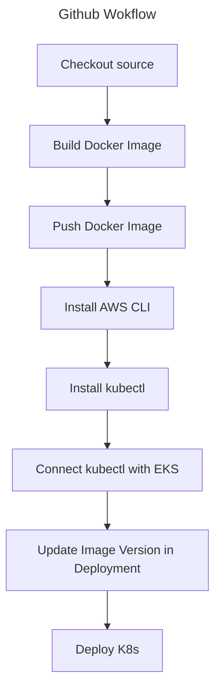

# VTI Devops
- This repository contains source code for my VTI DevOps course.

## Exercise 1: Docker
- I created a simple http server by golang.
- Build and run command
```sh
docker build -t dinhtranvan/simple-http-server .
docker run -p 8080:8080 dinhtranvan/simple-http-server
```

## Exercise 2: K8s
- I created 3 files.
  + `deployment.yaml`: for deploying pod.
  + `service.yaml`: for route.
  + `deploy-k8s.sh`: for deploying 2 above files to k8s.

## Exercise 3: K8s (continue)
- [X] Creating a secrect store in k8s.
  + Created a new file [secret.yaml](k8s/secret.yaml) to store data. The data is encoded by base64 format.
  ```yaml
  apiVersion: v1
  kind: Secret
  metadata:
    name: secret
  # `Opaque` means that the secret is not decoded by Kubernetes.
  type: Opaque
  data:
    username: ZGluaC10cmFu
    password: ZGluaDE5OTA=
  ```

- [X] Access value in the container.
  + Mount secret store as a volume in [deployment.yaml](k8s/deployment.yaml). K8s automatically decodes base64 value.
  ```yaml
  containers:
  - name: simple-http-server
    image: dinhtranvan/simple-http-server:v2
    ports:
    - containerPort: 8080
    volumeMounts:
    - name: secret-volume
      mountPath: /etc/secret-volume
      readOnly: true

  volumes:
  - name: secret-volume
    secret:
      secretName: secret
  ```

- Access the data by go to link http://localhost:8080/credential

## Exercise 4: CI/CD
### Runner
- Using Github action runner in [file](.github/workflows/deploy-to-k8s.yaml)
- Diagrams


### Kubernetes
- Using AWS EKS Service to host K8s cluster. The process of creation/deletion is automatically managed by Terraform. Link to [source code](terraform/k8s).

### Tasks
- [x] Provision a K8s cluster
- [-] Setup a github action pipeline.
  + [x] Setup environment variables and secret keys.
  + [x] Build docker image.
  + [x] Push the build image to the Docker registry.
  + [x] Connect kubectl to the k8s cluster.
  + [x] Deploy to EKS.
  + [ ] Auto run unit tests.
  + [ ] Auto run E2E tests.

### Steps
1. Adding a new github workflow action in folder `.github/workflows/deploy-to-k8s.yaml`.
2. In github repository page, go to `Settings` -> `Secrets and variables`. Add new environment variables and secret keys.

| **Name** | **Type** | **Usage** |
| -------- | -------- | --------------- |
| `DOCKER_USERNAME` | Secret | For pushing docker image. |
| `DOCKER_PASSWORD` | Secret | For pushing docker image. |
| `AWS_ACCESS_KEY_ID` | Secret | Authorize AWS for connect to EKS. |
| `AWS_SECRET_ACCESS_KEY` | Secret | Authorize AWS for connect to EKS. |
| `EKS_CLUSTER_NAME` | Secret | Connect to EKS cluster. Leave it empty. |

3. Go to folder `terraform/k8s` then deployment an EKS cluster on AWS. Get cluster name by below command. It'll take 20 minutes, be patient.
```shell
terraform output -raw cluster_name
```
4. Replace the secret `EKS_CLUSTER_NAME` by cluster name value.
5. Push code to trigger the pipeline.
6. Destroy the EKS cluster to avoid unnecessary charge.