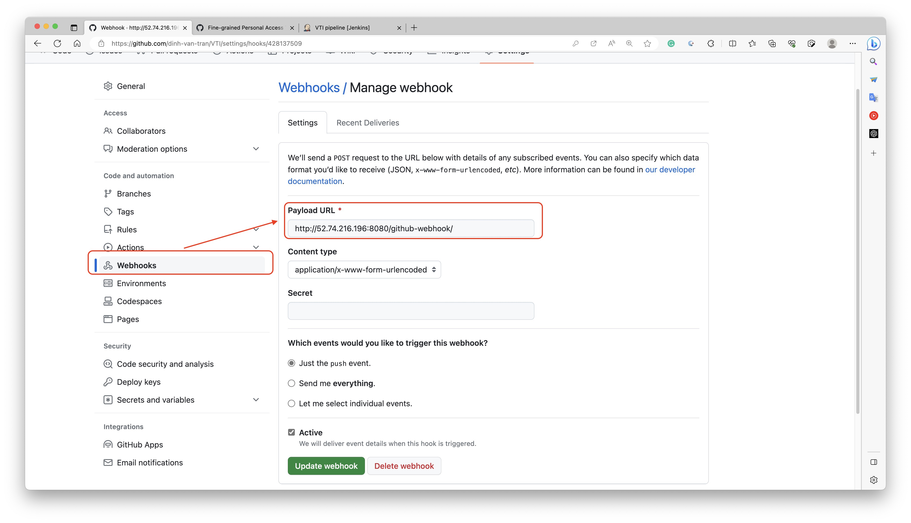

# 1. Description
- This repository contains source code for my VTI DevOps course.

# 2. Exercices

## 2.1 Exercise 1: Docker
- I created a simple http server by golang.
- Build and run command
```sh
docker build -t dinhtranvan/simple-http-server .
docker run -p 8080:8080 dinhtranvan/simple-http-server
```

---

## 2.2 Exercise 2: K8s
- I created 3 files.
  + `deployment.yaml`: for deploying pod.
  + `service.yaml`: for route.
  + `deploy-k8s.sh`: for deploying 2 above files to k8s.

---

## 2.3. Exercise 3: K8s (continue)
- [X] Creating a secrect store in k8s.
  + Created a new file [secret.yaml](k8s/secret.yaml) to store data. The data is encoded by base64 format.
  ```yaml
  apiVersion: v1
  kind: Secret
  metadata:
    name: secret
  # `Opaque` means that the secret is not decoded by Kubernetes.
  type: Opaque
  data:
    username: ZGluaC10cmFu
    password: ZGluaDE5OTA=
  ```

- [X] Access value in the container.
  + Mount secret store as a volume in [deployment.yaml](k8s/deployment.yaml). K8s automatically decodes base64 value.
  ```yaml
  containers:
  - name: simple-http-server
    image: dinhtranvan/simple-http-server:v2
    ports:
    - containerPort: 8080
    volumeMounts:
    - name: secret-volume
      mountPath: /etc/secret-volume
      readOnly: true

  volumes:
  - name: secret-volume
    secret:
      secretName: secret
  ```

- Access the data by go to link http://localhost:8080/credential

---

## 2.4 Exercise 4: CI/CD
### 2.4.1 Runner
- Using Github action runner in [file](.github/workflows/deploy-to-k8s.yaml)
- Diagrams


### 2.4.2 Kubernetes
- Provision a K8s cluster on AWS EKS Service by using Terraform. Link to [source code](terraform/k8s).

### 2.4.3 Tasks
- [x] Provision a K8s cluster
- [ ] Setup a github action pipeline.
  + [x] Setup environment variables and secret keys.
  + [x] Build docker image.
  + [x] Push the build image to the Docker registry.
  + [x] Connect kubectl to the k8s cluster.
  + [x] Deploy to EKS.
  + [ ] \(Optional) Auto run unit tests.
  + [ ] \(Optional) Auto run E2E tests.

### 2.4.4 Steps
1. Adding a new github workflow action in folder `.github/workflows/deploy-to-k8s.yaml`.
2. In github repository page, go to `Settings` -> `Secrets and variables`. Add new environment variables and secret keys.

| **Name** | **Type** | **Usage** |
| -------- | -------- | --------------- |
| `DOCKER_USERNAME` | Secret | For pushing docker image. |
| `DOCKER_PASSWORD` | Secret | For pushing docker image. |
| `AWS_ACCESS_KEY_ID` | Secret | Authorize AWS for connect to EKS. |
| `AWS_SECRET_ACCESS_KEY` | Secret | Authorize AWS for connect to EKS. |
| `EKS_CLUSTER_NAME` | Secret | Connect to EKS cluster. Leave it empty. |

3. Go to folder `terraform/k8s` then deployment an EKS cluster on AWS. After deployment, get the cluster name by below command.
```shell
terraform output -raw cluster_name
```

> **Note**
> The process takes approximately 20 minutes, be patient.

4. Replace the secret `EKS_CLUSTER_NAME` by cluster name value.
5. Push code to trigger the pipeline.
6. Destroy the EKS cluster to avoid unnecessary charge.

> **Important**
> When deploying k8s services, AWS will automatically create a Load Balancer which is not provisioned by terraform.
> When teardown resources, it'll cause error when detroying the VPC.
> To solve this, go to AWS console, VPC, Load Balancer, then delete it and run the command `terraform destroy` again.

---

## 2.5 Exercise 5: Jenkins
- [x] Setup a CI/CD pipeline by using Jenkins.
- [x] \(Optional) Host the Jenkins with Docker server on AWS EC2 using terraform.

> **Important**
> Jenkins server needs an public address for configure webhook.
> If you don't want to provision the Jenkins server on AWS EC2, consider using [ngrok](https://ngrok.com/) for obtain a temporary public address.

- Steps diagram:


### 2.5.1 Provision the Jenkins server
1. Provision an Jenkin server in AWS by [source](terraform/jenkins/).
1. SSH to the newly created Jenkins server and get admin password.
1. Go to server page, port 8080. Install recommend plugins and create a new user.

### 2.5.2 Obtain Github credential
- To access to Github data, Jenkins needs a username/password key.
- Go to Personal Settings (not project setting), `Developer settings`, `Personal access token`, `Fine-grained tokens`.

<details>
<summary>Get Token Page Screenshot</summary>


</details>

- Generate a new token, choose the correspondence project repository. In repository permission list, grant read-only for:
  + Access to code.
  + Commit status and metadata.

<details>
<summary>Select Permisisons Screenshot</summary>


</details>

- Click on generate button then copy the token.
- Go back to Jenkins, go to Dashboard, `Manage Jenkins`, `Security`, `Credential`, `System`, `Global credentials (unrestricted)`.

<details>
<summary>Add new credential option screenshot</summary>


</details>

- Add a new credential:

| **Field** | **Value** |
| --------- | --------- |
| `Kind` | Username and password |
| `Scope` | Global. |
| `Username` | Github username. |
| `Treat username as secret` | uncheck. |
| `Pasword` | Fine-grained token value. |
| `ID` | Github. |

<details>
<summary>Add new credential detail screenshot</summary>


</details>

### 2.5.3 Define Build Steps
- Add a new `Jenkinsfile` to the source code which contains very basic steps.

```groovy
pipeline {
  agent any
  stages {
        stage('Build') {
            steps {
                echo 'Hello World'
            }
        }
        stage('Test') {
            steps {
                echo 'Test'
            }
        }
        stage('Deploy') {
            steps {
                echo 'Deploy'
            }
        }
    }
}
```

### 2.5.3 Setup pipeline
- Go back to Jenkins Dashboard. On the left panel, click on `+ New Item`, fill `Enter an item name` then click on the `Pipeline` option.

<details>
<summary>Add new item screenshot</summary>


</details>

- In the `Configure` page, fill the description.
- In `General` section, check `GitHub project` and fill the project repository url.

> **Important**
> The github repository url must contain `.git` at the end. For example: `https://github.com/dinh-van-tran/VTI.git`.

<details>

<summary>Configure general section screenshot</summary>


</details>

- In `Build Triggers` section, select checkbox `GitHub hook trigger for GITScm polling` for later step `Adding Build Trigger`.
- Scroll to the end of page, in the `Pipeline` section, from `Definition` dropdown, choose `Pipeline script from SCM`.
  + Select `SCM` value `Git`.
  + Fill `Repository URL` the same value as `General` section.
  + Click on `Credentials` dropdown, select the newly created Github credential.
  + In `Branches to build`, fill the desired branch. In case build happens when there are commits to `main` branch, fill `*/main`.
  + In `Script Path`, fill `Jenkinsfile`.
- Click `Save`.

<details>

<summary>Configure SCM screenshot</summary>


</details>

- In the left panel, click on `Build Now` to trigger pipeline. If everything is correct, you'll see the result like this.

<details>

<summary>Pipeline build result screenshot</summary>


</details>

### 2.5.4 Adding Build Trigger
- If you want to trigger the Jenkins server build when new code is pushed to the repository, you need to setup a webhook in Github for notifying the Jenkins server.
- Make sure you've already selected the option `GitHub hook trigger for GITScm polling` when creating the pipeline.
- Go back to the Github repository, go to `Settings`, `Webhooks` then register a new webhook for the Jenkins server.
  + `Payload URL`: `http://jenkins_public_ip:8080/github-webhook/`
> **Important**
> Payload url must have slash character `/` at the end.
  + `Content type`: `application/x-www-form-urlencoded`
  + `Secret`: empty
  + `Which events would you like to trigger this webhook`: `Just the push event`

<details>

<summary>Adding a webhook screenshot</summary>



</details>

### 2.5.5 (Optional) Setup Docker
- In case you don't provision the Jenkins server by terraform script, you have to setup Docker manually.
1. Loggin to the Jenkins server by SSH.
2. Install Docker on the Jenkins server following this [link](https://docs.docker.com/engine/install/ubuntu/)
3. Authorize Jenkins running docker by running below command.
```shell
sudo usermod -aG docker jenkins
```
4. Restart the Jenkins server by go to the link `https://jenkins_pubic_ip:8080/restart`.

### 2.5.6 Add Build Image Step
- Modify the build step on Jenkinsfile as follow.
```groovy
stage('Build Docker Image') {
    steps {
        script {
            def gitSha = sh(returnStdout: true, script: 'git rev-parse HEAD').trim()
            sh "docker build -t dinhvantran/simple-http-server:${gitSha} ."
        }
    }
}
```

### 2.5.7 Add Push Image Step
1. In the Jenkins server, go to `Dashboad`, `Manage Jenkins`, `Credentials`, add a new credential for docker hub.

| **Field** | **Value** |
| --------- | --------- |
| `Kind` | Username and password |
| `Scope` | Global. |
| `Username` | Your docker hub username. |
| `Treat username as secret` | check. |
| `Pasword` | Your docker hub password. |
| `ID` | `docker-hub-credentials`. |

<details>

<summary>Adding a Docker Hub credentials screenshot</summary>


</details>

2. In Jenkinsfile, add a new step push image step
```groovy
stage('Push Docker Image') {
    steps {
        withCredentials([usernamePassword(credentialsId: 'docker-hub-credentials', usernameVariable: 'DOCKER_USERNAME', passwordVariable: 'DOCKER_PASSWORD')]) {
            script {
                def gitSha = sh(returnStdout: true, script: 'git rev-parse HEAD').trim()
                sh "docker login -u ${DOCKER_USERNAME} -p ${DOCKER_PASSWORD}"
                sh "docker push dinhtranvan/simple-http-server:${gitSha}"
            }
        }
    }
}
```
