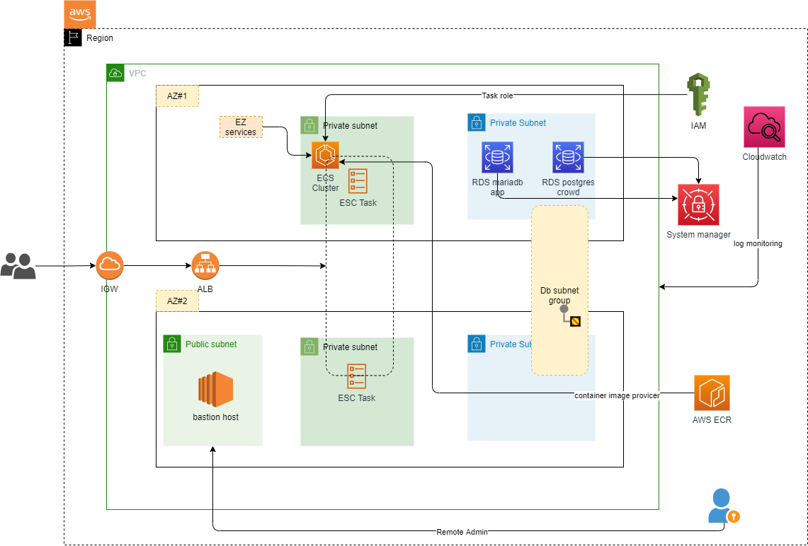

# Description
- This small terraform project demonstrates an example of provision a complete infrastructure with terraform on AWS.

# Overview


# Requirements
- Provision below AWS services

| Number | Name | Quantity | Description |
| ------ | ---- | -------- | ----------- |
| 1      | VPC  | 1 | Network for entire infrastructure. |
| 2      | IGW  | 1 | Internet Gateway for receiving requests from the internet. |
| 3      | Subnet  | 4 | 1 for public and 3 for private. |
| 4      | AWS  ECR | 1 | Store docker image data. |
| 5      | ECS  Cluster | 1 | For running docker container. |
| 6      | RDS  | 2 | 1 for Postgres and 1 for MariaDB. |
| 7      | EC2  | 1 | Bastion host for admin access. |

- The subnets are to provision in 2 Availability Zones:

| Number | Name | Availability Zone |
| ------ | ---- | -------- |
| 1 | Public Subnet | 1 |
| 2 | Private Subnet 1 | 1 |
| 3 | Private Subnet 2 | 2 |
| 4 | Private Subnet 3 | 1 |
| 5 | Private Subnet 4 | 2 |

# Implementation
- The implementation code is put in folder `modules`

```text
modules/
├── ec2
│   ├── bastion.tf
│   ├── outputs.tf
│   └── variables.tf
├── ecs
│   ├── ecr.tf
│   ├── ecs.tf
│   ├── load_balancer.tf
│   └── variables.tf
├── network
│   ├── internet_gateway
│   │   ├── internet_gateway.tf
│   │   └── variables.tf
│   ├── security_groups
│   │   ├── outputs.tf
│   │   ├── security_groups.tf
│   │   └── variables.tf
│   ├── subnets
│   │   ├── outputs.tf
│   │   ├── subnets.tf
│   │   └── variables.tf
│   └── vpc
│       ├── outputs.tf
│       ├── variables.tf
│       └── vpc.tf
└── rds
    ├── db_subnet_group.tf
    ├── maria_db.tf
    ├── postgres_db.tf
    └── variables.tf
```